# Testing

## Manual Testing

Testing was done throughout site development, for each feature before it was merged into the master file.

Usability was tested with the below user acceptance testing, sent to new users to ensure testing from different users, on different devices and browsers to ensure issues were caught and where possible fixed during development.

|     | User Actions           | Expected Results | Y/N | Comments    |
|-------------|------------------------|------------------|------|-------------|
| Sign Up     |                        |                  |      |             |
| 1           | Click on Sign Up button | Redirection to Sign Up page | Y |          |
| 2           | Click on the Login link in the form | Redirection to Login page | Y |          |
| 3           | Enter valid email | Field will only accept email address format + unique email | Y |          |
| 4           | Enter the same email in the field repeat email | Field will only accept email address format and the email that has been entered in the previous field | Y |          |
| 5           | Enter valid  | Field will only accept characters + unique username | Y |          |
| 6          | Enter valid password | Field will only accept secure passwords | Y |          |
| 7          | Enter valid password confirmation | Field will only accept the same password from the previous field | Y |          |
| 8          | Click on the Sign Up button | Takes user to confirm email page Sends address a confirmation request email | Y |          |
| 9          | Confirm email | Redirects user to blank Sign In page | Y |          |
| 10          | Sign In with the same email/username and password | Takes user to feed page | Y | |
| 11          | Click "Logout" in the navbar| Takes user to log out page to confirm logout | Y |          |
| 12          | Click "Logout" button  in the center of the page| Redirects user to home page | Y |          |
| 13          | Click browser back button | You are still logged out | Y |          |
| Log In      |                        |                  |      |             |
| 1           | Click on Login button | Redirection to Login page | Y |          |
| 3           | Click on the SignUp link in the form | Redirection to SignUp page | Y |          |
| 4           | Enter valid email or username | Field will only accept email address format | Y |          |
| 5           | Enter valid password | Field will only accept secure passwords | Y |          |
| 6           | Click on the Sign In button | Takes user to the feed page | Y |          |
| 7           | Clicks "Forgot Password" instead of "Sign In" | Redirects user to forgot password page | Y |          |
| 8           | Click "Logout" in the navbar | Takes user to log out page to confirm logout | Y |          |
| 9           | Click "Logout" button  in the center of the page| Redirects user to home page | Y |          |
| 10          | Click browser back button | You are still logged out | Y |          |
| Navbar     |                        |                  |      |             |
| 1          | Click "Profile" in the navbar | Redirects user to profile page | Y |          |
| 2          | Click "Feed" in the navbar | Redirects user to Feed page | Y |          |
| 3          | Click "Friends" in the navbar | Takes user to Friends Page | Y |          |
| 4          | Click "Communities" in the navbar | Takes user to Communities page | Y |          |
| 5          | Click "Messages" in the navbar | Takes user to Messages page | Y |          |
| 6          | Click "Search" in the navbar | Takes user to Search page | Y |          |
| 7          | Click "Logout" in the navbar | Takes user to log out page to confirm logout | Y |          |
| Profile (user profile)   |                        |                  |      |             |
| 1           | Click "Profile Settings" in the profile data box | Redirects user to profile settings page | Y |          |
| 2           | Click "Edit Avatar" in the profile data box | Asks the user to add/change avatar | Y |          |
| 3           | Click "Add new post" in the profile posts wall | An error message will appear if the user enters a blank post | Y |          |
| 4         | User Types in a post + clicks "Post" | The post will be added to the wall | Y |   User is able also to click on the paper clip to add image for the post       |
| 5       | Click on the user name in the post | Redirects user to the user profile page | Y |          |
| 6       | Click on the edit button in the post | modal will appear with the post content | Y | User is able to edit only his own posts |
| 7       | Click on the delete button in the post | Pop up window will appear for the confirmation, The post will be deleted if the user confirms the deletion | Y | User is able to delete only his own posts |
| 8       | Click on the like button in the post | The post will be liked | Y | User is able to like all posts |
| 9       | Click on the comment button in the post | The comment will be added to the post | Y | User is able to comment all posts |
| 11      | Click dislike button in the post | The post will be disliked | Y | User is able to dislike all posts |
| Profile (other user's profile)   |                        |                  |      |             |
| 1           | Click "Chat" in the profile data box | Redirects user to chat page | Y |   This button is present if the other suer is a friend |
| 2           | Click "Unfriend" in the profile data box | Asks the user to confirm unfriending | Y |    This button is present if the other suer is a friend |
| 3         | Click "Add to friends" in the profile data box | Asks the user to confirm adding to friends | Y |    This button is present if the other suer is not a friend, the user will be added to friends if the other user confirms |
| 4         | Click "Accept" in the profile data box | Asks the user to confirm accepting friend request | Y |    This button is present if the other suer is not a friend but request was sent |
| 5       | Click "Decline" in the profile data box | Asks the user to confirm declining friend request | Y |    This button is present if the other suer is not a friend but request was sent |
| 6     | Click "Show" friends in the Friends box | Modal will appear with the list of friends | Y |    This button is present if the other suer is a friend |
| 7     | Click "Show" communities in the Communities box | Modal will appear with the list of communities | Y |    This button is present if the other suer is a member of any community |
| 8         | User Types in a post + clicks "Post" | The post will be added to the wall | Y |   User is able also to click on the paper clip to add image for the post       |
| 9       | Click on the user name in the post | Redirects user to the user profile page | Y |          |
| 10       | Click on the like button in the post | The post will be liked | Y | User is able to like all posts |
| 11       | Click on the comment button in the post | The comment will be added to the post | Y | User is able to comment all posts |
| 12      | Click dislike button in the post | The post will be disliked | Y | User is able to dislike all posts |
| Profile Settings |                        |                  |      |             |
| 1           | Edit in the avatar form | Asks the user to add/change avatar | Y |          |
| 2       | "Remove" avatar in the avatar form | Asks the user to confirm removing avatar | Y |          |
| 3     | User edits First Name | The field will accept only letters | Y |          |
| 4     | User edits Last Name | The field will accept only letters | Y |          |
| 5     | User edits Country | Dropdown will appear with the list of countries | Y |          |
| 6     | User edits City | Dropdown will appear with the list of cities | Y |          |
| 7 | User edits Bio | The field will accept only characters | Y |          |
| 8 | User date of birth | Calendar will appear with the list of years | Y |          |
| 9 | User clicks "Save" button | The changes will be saved | Y |          |
| 10 | User types old password in the change password form | The field will accept only secure passwords that uer has used before | Y |          |
| 11 | User types new password in the change password form | The field will accept only secure passwords | Y |          |
| 12 | User types new password confirmation in the change password form | The field will accept only secure passwords | Y |          |
| 13 | User clicks "Save" button in the change password form | The changes will be saved | Y |          |
| 14  | User clicks "Delete Profile" button | Asks the user to confirm deleting profile with 2 options: "Yes, delete" and "No, cancel" | Y |          |
| 15  | User clicks "Yes, delete" button in the delete profile form | The profile will be deleted | Y |          |
| 16  | User clicks "No, cancel" button in the delete profile form | The profile will not be deleted | Y |          |
| Feed Page  |                        |                  |      |             |
| 1        | Click on the user name in the feed | Redirects user to the user profile page | Y |          |
| 2      | Click on the post link in the feed | Redirects user to the post page | Y |          |
| 3        | Click on the community name in the feed | Redirects user to the community page | Y |          |
| Friends Page  |                        |                  |      |             |
| 1        | Click on the "My Friends" tab in the Friends page | Only the friends will be shown | Y |          |
| 2        | Click on the "Requests" tab in the Friends page | All the friends' requests will be shown | Y |          |
| 3  | Click on the friend card in the friends box | Redirects user to the user profile page | Y |          |
| Communities Page  |                        |                  |      |             |
| 1     | Click on the "Create new Community" button in the Communities page | Redirects user to the create community page | Y |          |
| 3    | Click on the community card in the communities box | Redirects user to the community page | Y |          |
| Community Page  |                        |                  |      |             |
| 1    | Click on "View all" members in the community page | Modal will appear with the list of members | Y |          |
| 2    | Click on the user name in the members box | Redirects user to the user profile page | Y |          |
| 3   | Click on the "Leave" button in the community page | Asks the user to confirm leaving the community | Y |   If the user is a member and not a creator of the community       |
| 4    | Click "Join community" in the community page | Asks the user to confirm joining the community | Y |   If the user is not a member and not a creator of the community       |
| 5     | Click "Settings" in the community page | Redirects user to the community settings page | Y |          |
| 6     | Click "Show" friends in the Friends box | Modal will appear with the list of friends | Y |    This button is present if the other suer is a friend |
| 7     | Click "Show" communities in the Communities box | Modal will appear with the list of communities | Y |    This button is present if the other suer is a member of any community |
| 8         | User Types in a post + clicks "Post" | The post will be added to the wall | Y |   User is able also to click on the paper clip to add image for the post       |
| 9       | Click on the user name in the post | Redirects user to the user profile page | Y |          |
| 10       | Click on the like button in the post | The post will be liked | Y | User is able to like all posts |
| 11       | Click on the comment button in the post | The comment will be added to the post | Y | User is able to comment all posts |
| 12      | Click dislike button in the post | The post will be disliked | Y | User is able to dislike all posts |
| Community Settings Page  |                        |                  |      |             |
| 1    | User Types in a name for the community | The name will be changed | Y |   Available only for the creator of the community |
| 2    | User Types in a description for the community | The description will be changed | Y |  Available only for the creator of the community |
| 3    | User Choose file for the community background | The background will be changed | Y |  Available only for the creator of the community |
| 4    | User Choose file for the community logo | The logo will be changed | Y |  Available only for the creator of the community |
| 5    | User clicks save button in the community settings page | The changes will be saved | Y |  Available only for the creator of the community |
| 6    | User clicks "delete community" |  Confirmation message will appear with 2 buttons "Yes, delete" and "No, cancel" | Y |  Available only for the creator of the community |
| 7    | User clicks "Yes, delete" in the confirmation message | The community will be deleted | Y |  Available only for the creator of the community |
| 8    | User clicks "No, cancel" in the confirmation message | The community will not be deleted | Y |  Available only for the creator of the community |
| Messages Page  |                        |                  |      |             |
| 1     | Click on the message box in the messages box | Redirects user to the chat page | Y |          |
| Chat page  |                        |                  |      |             |
| 1 | User clicks on the user name in the chat/in the top chat navbar | Redirects user to the user profile page | Y |          |
| 2 | User types in the message box | The message will appear in the textarea| Y | Other user can see "Typing..." message |
| 3 | User clicks on the send button | The message will be sent | Y |          |
| 4 | User clicks on the emoji button | The emoji will appear in the textarea | Y |          |
| Search |                        |                  |      |             |
| 1 | User types in the search field | The search results will be shown | Y | If the user chooses "People" in the search navbar, people will be shown. If the user chooses "Communities" in the search navbar, communities will be shown. If the user chooses "Posts" in the search navbar, posts will be shown. |
| 2 | User clicks on the user card in the search results | Redirects user to the user profile page | Y |          |
| 3 | User clicks on the community card in the search results | Redirects user to the community page | Y |          |

---

## Testing User Story

| First Time Visitor Goals | Requirement met | Image |
| ------------------------- | --------------- | ----- |
| As a First Time Visitor, I want to be able to easily understand the main purpose of the app, so that I can learn more about this app. | Y | 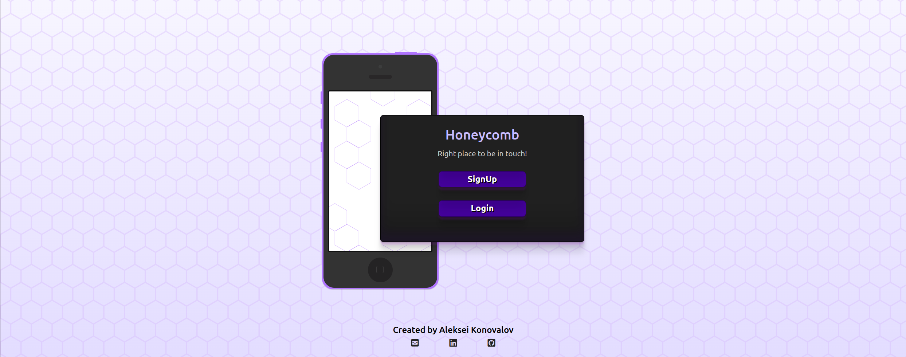|
| As a First Time Visitor, I want to be able to easily navigate through the app, so that I can find presented content. | Y | |
| As a First Time Visitor, I want to be able to register my account, so that I can learn the benefits of the app as a user. | Y | 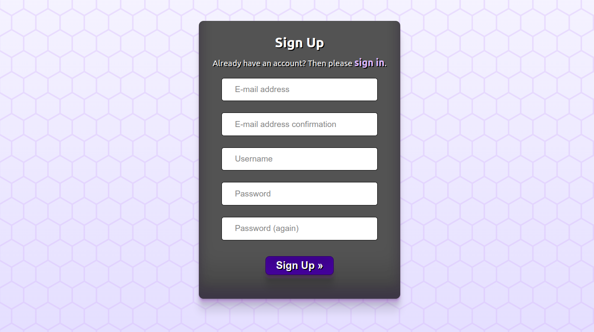|
| As a First Time Visitor, I want to be able to find the app useful, so that I can use it according to my needs. | Y | 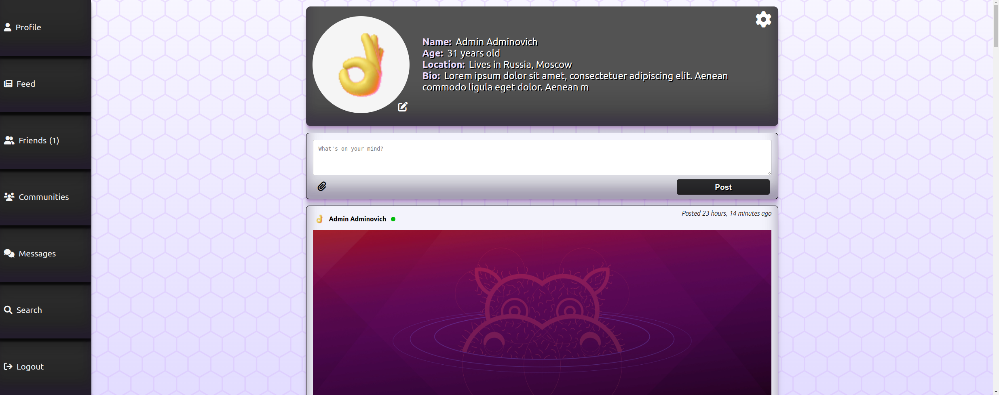|

| Frequent Visitor Goals | Requirement met | Image |
| ----------------------- | --------------- | ----- |
| As a Frequent User, I want to be able to see whether users are online, so that I can know who is online. | Y |   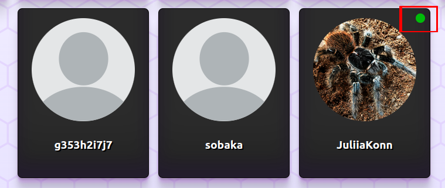  |
| As a Frequent User, I want to be able to log in to my account, so that I can have a personal account. | Y | |
| As a Frequent User, I want to be able to easily navigate through the app, so that I can find the content without additional efforts. | Y | |
| As a Frequent User, I want to be able to easily log in and log out, so that I can access my personal account information. | Y | |
| As a Frequent User, I want to be able to easily recover my password in case I forget it, so that I can recover access to my account. | Y | 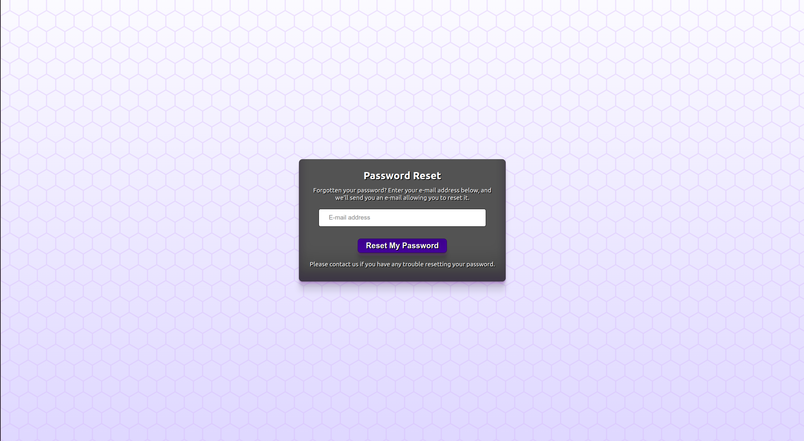|
| 1. As a Frequent User, I can be able to change my password, so that I can be sure that nobody else can access my account. 2. As a Frequent User, I can be able to change my password, so that I can be sure that nobody else can access my account. 3. As a Frequent User, I want to be able to update my personal data, so that I can keep my account up to date. 4. As a Frequent User, I want to be able to update my avatar, so that I can keep my avatar up to date. | Y | 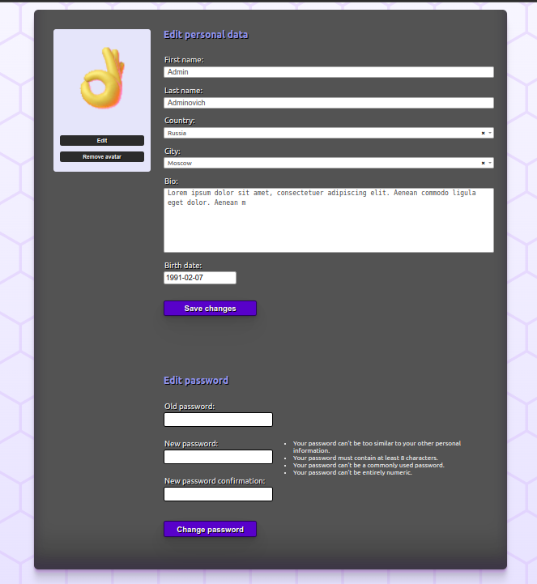|
| As a Frequent User, I want to be able to delete my profile, so that I can remove my account from the app. | Y | |
| As a Frequent User, I want to be able to add friends, so that I can communicate with my friends. | Y | |
| As a Frequent User, I want to be able to delete friends, so that I can feel safe in this social network. | Y | |
| 1. As a Frequent User, I want to be able to search through the users of the social network, so that I can find people who I am interested in. 2.  As a Frequent User, I want to be able to search people by their names, so that I can find people who I know.| Y | |
| As a Frequent User, I want to be able to add a new post on my page or my friends' pages, so that I can share my knowledge and experiences with others. | Y | |
| 1. As a Frequent User, I want to be able to react to my post, so that I can share my knowledge and experiences with others. 2. As a Frequent User, I want to be able to react to other people's post, so that I can share my knowledge and experiences with others. | Y | |
| As a Frequent User, I want to be able to be able to edit/delete my posts, so that I can change my knowledge and experiences. | Y | 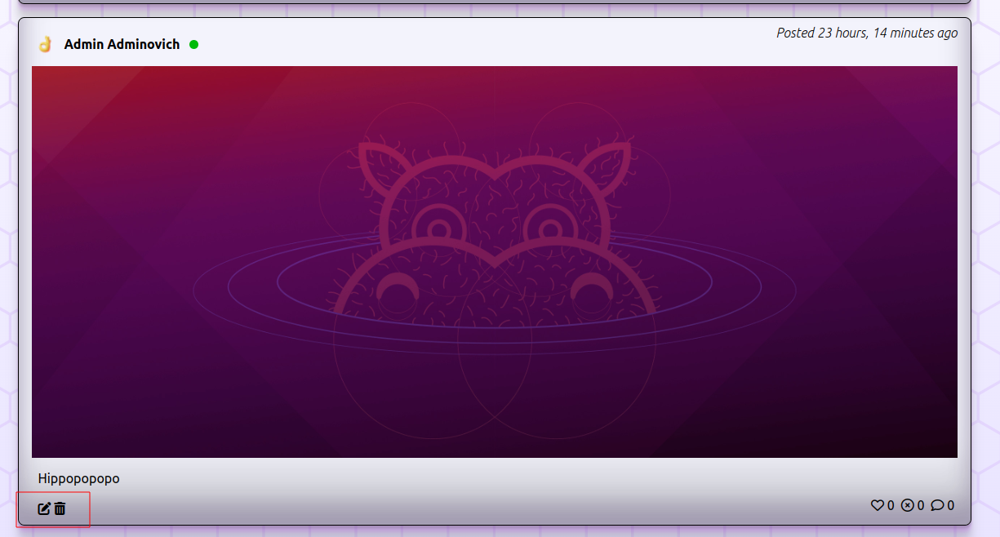|
| 1. As a Frequent User, I want to be able to add a new comment on my post, so that I can share my knowledge and experiences with others. 2. As a Frequent User, I want to be able to add a new comment to other people's post, so that I can share my knowledge and experiences with others. | Y | |
| As a Frequent User, I want to be able to create a community, so that I can share my ideas and interests with others. | Y | 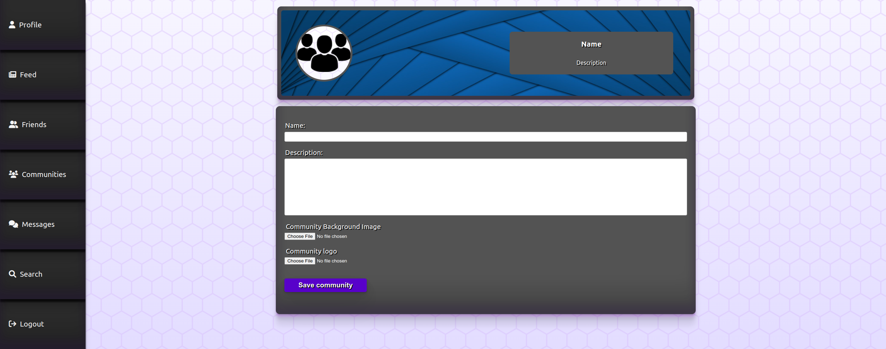|
| As a Frequent User, I want to be able to join a community, so that I can be a part of that community. | Y | 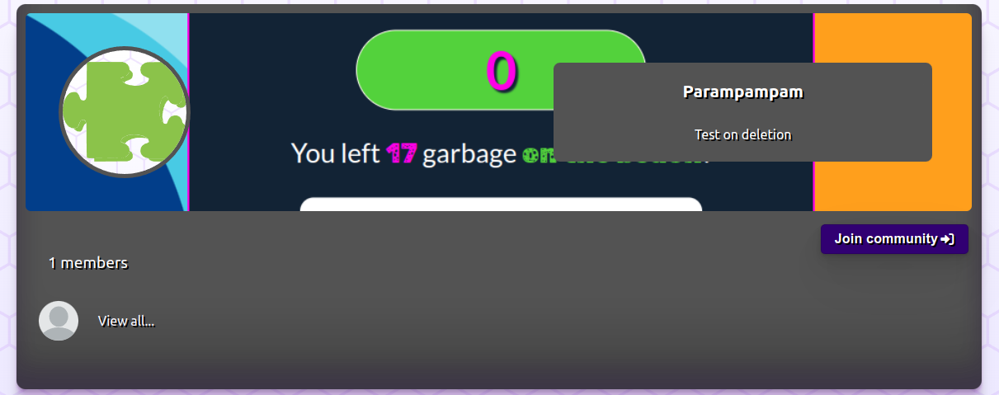|
| As a Frequent User, I want to be able to add a new post in a community, so that I can share my ideas and interests with others. | Y | 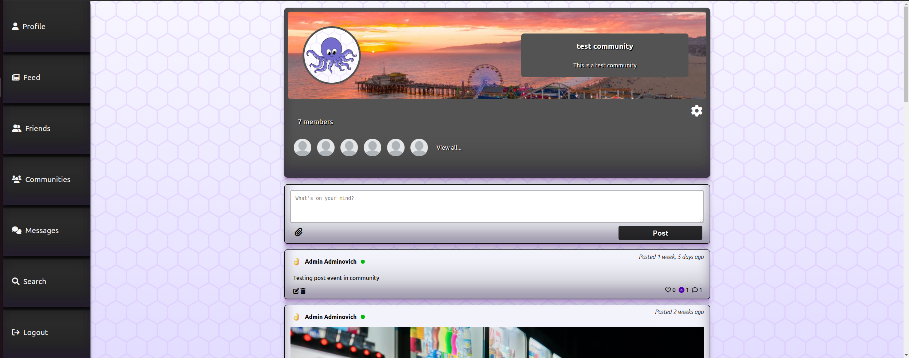|
| As a Frequent User, I want to be able to share my experiences with other users, so that I can share my knowledge and experiences with others. | Y | |
|  As a Frequent User, I want to be able to send messages to other users, so that I can communicate with them. | Y | |
| As a Frequent User, I want to be able to delete communities that I created, so that I can remove my community from the app. | Y | |

---

## Automated testing

### Django unit testing

Django unit testing is a framework that allows you to write tests for your Django application. It is a good way to test your application's functionality and to make sure that your code is working as expected. 

I tried to cover as much of the project functionality as possible. The total coverage is 93%.

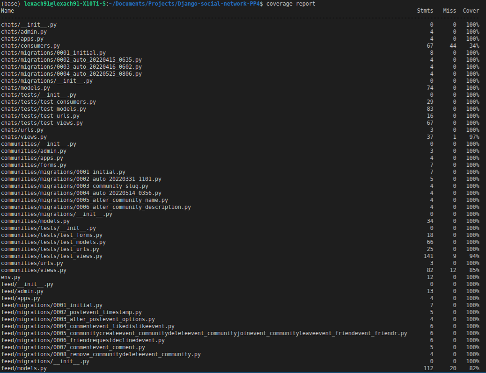

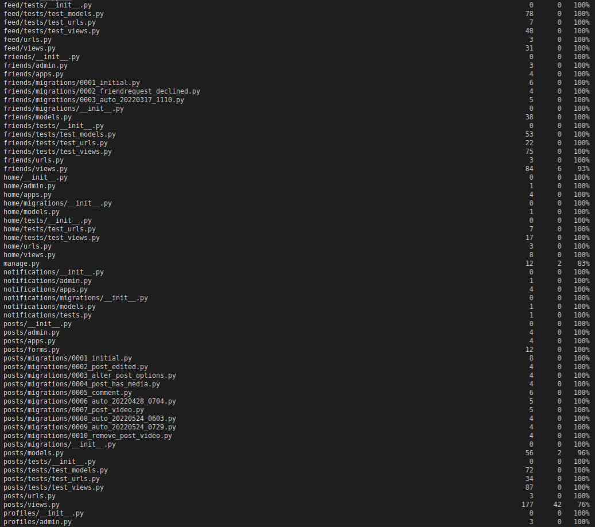

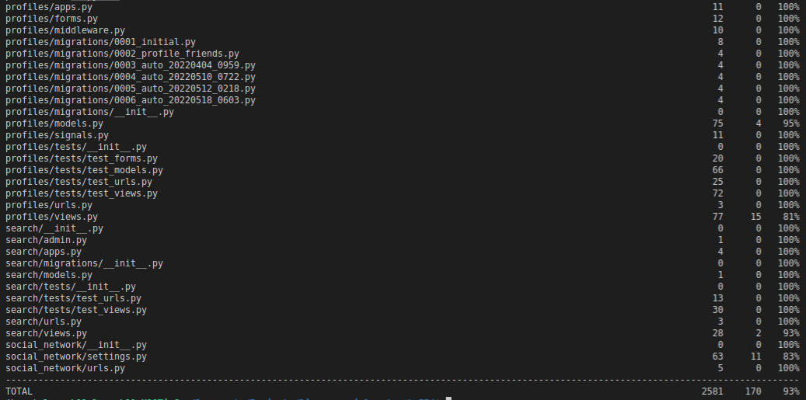

I could not properly test the consumers and routing of the chats and notifications apps, because of the lack of documentation on django-channels website.

### Jest unit testing

Jest unit testing will go here......

---

## Validation

### HTML Validation:

- HTML validation was done by using the official [W3C](https://validator.w3.org/) validator. This checking was done manually by copying the view page source code (Ctrl+U) and pasting it into the validator.

- [Full HTML Validation Report](documentation/validation/html_validation.pdf)

- There were errors and warnings about duplicated IDs on pages, where there's a posting and commenting functionality. That occurred because of the fact that multiple comment forms were on the same page, under each post. However, this does not affect the functionality of the app, because each comment form is processed separately.

### CSS Validation:

- [Full CSS Validation Report](documentation/validation/css_validation.png)

- No errors or warnings were found when passing through the official [W3C (Jigsaw)](https://jigsaw.w3.org/css-validator/#validate_by_uri) validator except for the warnings about the use of css root variables and webkit css rules for the box-shadow. However, css code works perfectly on various devices.

### JS Validation:

- [JS Validation Report. base.js](documentation/validation/js_validation_base_js.png)
- [JS Validation Report. chatRoom.js](documentation/validation/js_validation_chatroom.png)
- [JS Validation Report. notifications.js](documentation/validation/js_validation_notifications.png)

- No errors or warning messages were found when passing through the official [JSHint](https://www.jshint.com/) validator. However, the validator complained about undefined variables that come from JS libraries.

### Python Validation:
- [Full Python Validation Report](documentation/validation/python_validation.pdf)

- No errors were found when the code was passed through Valentin Bryukhanov's [online validation tool](http://pep8online.com/). According to the reports, the code is [Pep 8-compliant](https://legacy.python.org/dev/peps/pep-0008/). This checking was done manually by copying python code from all the files and pasting it into the validator.

---
## Lighthouse Report

- [Full Lighthouse Report](documentation/validation/lighthouse_report.pdf)

- Lighthouse report was generated for every pages, using Chrome Dev Tools.

---